# Business Entity Resolution at Scale: ML Challenge 2026 (Amazon)

This pipeline links **1.73M business records** from one source to their duplicates among **~10M noisy records** from two other sources. The records come from three countries, and France appears only in the test set.

- **Best public leaderboard score:** **0.975 macro F0.5** (run `ec2-v55`). Out-of-fold (OOF) score 0.9834, and a 5% holdout scored exactly like test gave 0.9834.
- **How it runs:** end to end on a single 8-vCPU AWS EC2 machine, with data and results on S3.
- **What's written from scratch:** parsing, blocking, string similarity, calibration, the decision layer and the metric. NumPy/SciPy/numba compile the loops, and LightGBM trains the trees.

```mermaid
flowchart TB
    subgraph IN["Input: 7 TSVs (entity_id, business_name, business_address, country)"]
        S1["Source 1<br/>test 1.73M · train 2.21M"]
        S23["Sources 2 + 3<br/>test 9.97M · train 10.3M"]
        GT["train ground truth<br/>7.64M true pairs"]
    end

    subgraph PREP["1 · prepare (encode.py, normalize.py, lexlearn.py)"]
        POOL["Training pools shaped like each test country<br/>size k and density d matched · extra pool per unseen country (us_fr)"]
        PARSE["Name parser: 9 Indic scripts → Latin, accents, look-alike digits,<br/>aliases/dba, domains, legal forms, stop words, sibling + churn words"]
        ADDR["Address parser: state/region extraction, numbers vs words,<br/>street types, units, ordered digit runs, state fill"]
        LEX["Lexicon mined from true pairs<br/>(Indic words, token swaps)"]
        ENC["CSR arrays + IDF per (pool, word)"]
        POOL --> PARSE --> ADDR --> ENC
        LEX --> PARSE
    end

    subgraph BLOCK["2 · block (retrieval.py): 6.7 trillion within-pool pairs → ~50M"]
        VEC["Sparse vector per record over 7 hashed feature types<br/>name tokens · name trigrams · addr tokens · addr numbers ·<br/>number×addr word · number×name word · glued name spans"]
        COS["IDF-weighted cosine, chunked sparse mat-mul,<br/>prefix filter (top 48 features per query), df caps"]
        FR["forward top-150 per S1 ∪ reverse top-10 S1s per record<br/>recall 0.9919"]
        VEC --> COS --> FR
    end

    subgraph RR["3 · rerank"]
        LGBR["LightGBM re-ranker on 21 cheap columns<br/>keep top-30 per S1 + each record's best S1<br/>recall 0.9918 → candidate_pairs.tsv"]
    end

    subgraph FEAT["4 · features (pairfeats.py, strsim.py, fsem.py): all numba"]
        F71["71 columns per pair: Jaro-Winkler, bit-parallel Levenshtein, trigram Dice,<br/>Monge-Elkan, IDF token cosine, unmatched IDF mass, number agreement / near-miss,<br/>soft token match, sibling/churn words, candidate structure, retrieval context,<br/>Fellegi-Sunter log-likelihood (supervised m/u table)"]
    end

    subgraph TRAIN["5 · train (models.py, stack.py, groupfeats.py): 3-fold CV grouped by S1 + 5% holdout"]
        ST1["Stage 1 LightGBM<br/>71 features, monotone constraints"]
        ST2["Stage 2 LightGBM<br/>+23 context / group / source features from p1"]
        ST3["Stage 3 LightGBM<br/>+23 features from p2 (117 total)"]
        EXP["optional: per-country experts +<br/>unconstrained model, log-loss blend"]
        ST1 --> ST2 --> ST3 --> EXP
    end

    subgraph DEC["6 · decide (decide.py)"]
        CAL["Isotonic calibration (PAV)<br/>per country; unseen country uses its look-alike pool"]
        HM["Has-match model: P(S1 has ≥1 true match)"]
        EXC["Exclusivity: each S2/S3 record belongs to ≤ 1 S1<br/>(hard margin δ or soft odds normalisation)"]
        EF["Exact expected-F0.5 set selection per S1<br/>(Poisson-binomial DP; empty list allowed)"]
        CAL --> EXC --> EF
        HM --> EF
    end

    OUT["matching_results.tsv<br/>+ 8 validated variants · self-training variant · diagnostics"]

    S1 --> PREP
    S23 --> PREP
    GT --> PREP
    ENC --> VEC
    FR --> LGBR --> F71 --> ST1
    EXP --> CAL
    EF --> OUT
```



---

## Contents
1. [Results: every run, with its scores and training stats](#1-results-every-run-with-its-scores-and-training-stats)
2. [The problem](#2-the-problem)
3. [Architecture, component by component: what, why, and what it got us](#3-architecture-component-by-component-what-why-and-what-it-got-us)
4. [What we tried and rejected](#4-what-we-tried-and-rejected)
5. [Version history](#5-version-history)
6. [Repository layout](#6-repository-layout)
7. [How to run it](#7-how-to-run-it)
8. [Outputs and how to read them](#8-outputs-and-how-to-read-them)
9. [Challenge rules and compliance](#9-challenge-rules-and-compliance)
10. [Known limitations and next steps](#10-known-limitations-and-next-steps)

---

## 1. Results: every run, with its scores and training stats

All runs used the full test set. They ran on AWS EC2 in us-east-1, on an **r6i.2xlarge** (8 vCPU, 64 GB RAM plus 48 GB swap, On-Demand), except `ec2-v57`, which ran on an **r7i.2xlarge Spot** instance. The metric is the challenge metric: per-S1 F0.5, averaged over all S1s.

### 1.1 Scores

| Run | Code | OOF macro F0.5 | OOF US | OOF India | France-like pool (`us_fr`) | Holdout | **Public LB** |
|---|---|---|---|---|---|---|---|
| `ec2-v1` | v1 | 0.9758* | 0.9773 | 0.9736 | – | – | **0.960** |
| `ec2-v2` | v2 | 0.97595* | 0.9774 | 0.9737 | – | – | not uploaded |
| `ec2-v3` | v3 | 0.97426 | 0.9789 | 0.9699 | – | – | **0.965** |
| `ec2-v4` | v4 | 0.97832 | 0.9821 | 0.9748 | – | – | **0.953** |
| `ec2-v5` | v5 | 0.98012 | 0.9839 | 0.9752 | 0.9875 | – | **0.968** |
| **`ec2-v55`** | **v5.5** | **0.98337** | **0.9858** | **0.9802** | 0.989 (decided as France) | **0.98336** | **0.975** |
| `ec2-v57` | v5.5 + experts | train step: US 0.9876, India 0.9842 | 0.9876 | 0.9842 | 0.9905 | – | not scored (see below) |

\* v1/v2 trained on a denser sample than test (8.12 S2/S3 per S1 against test's 5.75), so their OOF isn't comparable with v3+. Each version's OOF is comparable with the next from v3 onwards.

Notes:
- **Blank-France diagnostic.** We uploaded `ec2-v5` with France's lists emptied and it scored 0.837. That puts France at about **0.93** on test (range 0.91–0.95), while US and India score about 0.3–0.4 points below their OOF. This is how we learned where the remaining error is. Test shares are US 38.3%, India 46.8% and France 15.0%.
- **`ec2-v57`** finished its training step with the best per-country OOF of any run. The AWS account was suspended before its outputs could be downloaded, so it has no leaderboard score.

### 1.2 Training stats per run (from the EC2 logs in [`results/`](results/))

| | ec2-v1 | ec2-v2 | ec2-v3 | ec2-v4 | ec2-v5 | ec2-v55 |
|---|---|---|---|---|---|---|
| Training S1s (pools) | 804,682 | 804,682 | 1,372,558 (us, india) | same as v3 | 1,632,264 (us, india, us_fr) | 1,632,264 minus 5% holdout |
| Blocking: pairs (train) | 91.3M | 91.6M | 147.9M | reused v3 | 206.7M | 274M |
| Blocking recall (train) | 0.9900 | 0.9908 | 0.9885 | reused | 0.9903 | **0.9919** |
| After re-rank: pairs / per S1 | 20.8M / 25.8 | 20.8M / 25.8 | 34.6M / 25.2 | reused | 45.9M / 28.1 | 49.3M / 30.2 |
| Recall after re-rank (the ceiling) | 0.9887 | 0.9895 | 0.9870 | 0.9870 | 0.9890 | **0.9918** |
| Features per stage | 45 → 54 | 46 → 55 | 46 → 55 | 52 → 74 | 52 → 74 | 71 → 94 → 117 |
| Rows per fold fit | 9.8M | 9.8M | 9.6M | 19.1M | 26.7M | ≤ 1.0M S1s |
| Stage-1 rounds (folds → final) | 856/944/825 → 962 | 646/783/905 → 855 | 727/769/871 → 867 | 773/1038/742 → 936 | 989/1260/1043 → 1207 | 1132/1224/1182 (fold models on test) |
| Stage-2 rounds (folds → final) | 409/314/273 → 365 | 572/362/363 → 475 | 486/483/607 → 577 | 731/1020/761 → 921 | 1591/1896/1827 → 1948 | fold models |
| Pair precision / recall (OOF) | 0.9910 / 0.9481 | 0.9908 / 0.9493 | 0.9916 / 0.9433 | 0.9934 / 0.9536 | 0.9940 / 0.9573 | – |
| Singleton accuracy | 0.9628 | 0.9625 | 0.9623 | 0.9648 | 0.9690 | – |
| Decision chosen | δ 0.3, exp-F0.5 | exp-F0.5 | US hard 0.6, India soft | US hard 0.5, India hard 0.3 | hard 0.4 + has-match | per-group tuning |
| Step times | prepare 8.5 min, block 54 min, rerank 9.4 min, features 2.7 min, train 34 min, predict 15 min | block 75 min, train 34 min, predict 17 min | prepare 10 min, block 60 min, rerank 11 min, train 44 min, predict 16 min | features 3.4 min, train 105 min, predict 29 min | prepare 11 min, block 40 min, rerank 13 min, features 4.4 min, train 3 h 53 min, predict 52 min | prepare 12 min, block 44 min, rerank 39 min, features 11 min, 3 stages + predict + extras ≈ 7.5 h |
| **Pipeline time** | **2 h 04 min** | 2 h 27 min | 2 h 31 min | 2 h 24 min | 6 h 03 min | **≈ 9 h 25 min** |

- **Cost:** v1 cost about **$1.10** on On-Demand. All runs together stayed well inside $100 of credits.
- **Memory:** v1 peaked at about 52 GB. The 48 GB swap file covers peaks in the later versions.
- **`ec2-v55` numbers** come from its live log and final report: the report sat on S3, and only the submission files were downloaded before the account was suspended. The `ec2-v1`…`ec2-v5` folders in `results/` hold the original `report.json`, the full run log, the validator output, the variant summary and, for v3/v4, the error budget and train-vs-test shift report.

### 1.3 Where the remaining error is (v4 OOF error budget; points of F0.5 lost)

| Error type | Meaning | Points lost |
|---|---|---|
| `dropped_true` | a true record was a candidate but wasn't selected | 1.14 |
| `false_match` | a wrong record was selected for an S1 that has matches | 0.43 |
| `block_miss` | a true record was never retrieved | 0.40 |
| `singleton_fp` | something was selected for an S1 with no match (scores 0) | 0.20 |
| `rerank_miss` | a true record was retrieved, then cut by the re-ranker | 0.05 |

In the error samples:
- 48% of `dropped_true` records had **no address**;
- 63% involved an S1 whose **name another S1 shares** (chains and branches);
- many were **house numbers one digit off** (`1131`/`1132`) or split by formatting (`7-04`/`704`).

v5.5's new features target exactly these.

---

## 2. The problem

- **Task.** For every Source 1 (S1) record, list **all** Source 2/Source 3 records of the same business. Each record has `entity_id`, `business_name`, `business_address` and `country`.
- **Metric.** Per-S1 F0.5 = 1.25·TP / (|predicted| + 0.25·|true|), averaged over S1s. An S1 with no true match scores 1 for an empty list and **0 for any prediction**. Precision is worth twice as much as recall.
- **Data.** Train has 2.2M S1 and 10.3M S2+S3 (US, India) with 7.64M labelled pairs. Test has 1.73M S1 and 9.97M S2+S3 (US, India and **France, never seen in training**).

**Facts about the data that drove the design:**

| Fact | Consequence |
|---|---|
| Each S2/S3 record belongs to **at most one** S1 | Exclusivity in the decision layer |
| 5.6% of S1s have no match; the rest have 1–6+ (mean 3.46) | Per-S1 set selection instead of one global threshold |
| ~26% of S2/S3 records are distractors (no S1) | Precision-first decisions |
| 52% of S1s share a stripped name with another S1 | Addresses and numbers decide; name-frequency and candidate-structure features |
| Exact-token blocking caps recall at ~89–93% | Weighted top-K retrieval with character trigrams |
| Test is 23% denser (5.75 vs 4.67 S2/S3 per S1) | Training pools reshaped to test's size and density |
| ~18% of Indian S2/S3 names are in an Indian script | Transliteration of 9 scripts + a lexicon mined from pairs |
| Distractors are often "S1 name + qualifier" (X Holdings, X Enterprises, Groupe X) | Sibling-word features; churn words ("Services") go the other way |
| France is unseen, and countries are an **open set** | Nothing country-specific is hard-coded; a labelled training pool is shaped like each unseen country |

---

## 3. Architecture, component by component: what, why, and what it got us

### 3.1 Training pools shaped like the test countries (`encode.py`)
- **What.** Each training country is resampled so that its pool matches the test pool it stands for, in both **size** (share k of S1s kept) and **density** (share d of S1s dropped, with their records left in as distractors). v5 adds an extra pool per unseen test country, built from spare US S1s sized and densified like France (`us_fr`). v5.5 makes it automatic (`pools_extra="auto"`).
- **Why.** Pool size changes IDF weights, name frequencies, retrieval ranks and how many look-alikes compete for each record. A model trained on a different world makes its mistakes in the wrong places.
- **Why not train on everything as-is?** v1/v2 did (with a sampling bug that made the pool too dense). Their OOF of 0.976 was optimistic against a 0.960 LB.
- **What it got us.** v3's OOF went *down* (0.9743), but its LB went *up* to **0.965**: the OOF became honest. The `us_fr` pool gives France decision settings learned on labelled data shaped like France, instead of pooled US/India settings.

### 3.2 Parsing and normalisation (`normalize.py`, `lexicons.py`, `lexlearn.py`)
- **What.**
  - **Names:** transliteration of 9 Indic scripts to Latin, accents removed, look-alike digits fixed (`KEYST0NE`), `M/s`, `(ID: 123)` and trailing `#1234` removed, aliases split out (`aka`, `dba`), domains, `&`→`and`, legal forms split out, stop words dropped.
  - **Addresses:** treated as unordered components, with state and region extraction, numbers separated from words, street types, directions and units normalised, per-country rules (Indian floors, French `bis/ter`) and ordered digit runs.
  - **State fill:** a missing state is filled from address words that imply one state (at least 95% of ≥ 20 sightings).
  - **Lexicon:** mined from true training pairs (Indic word → Latin, and single-token swaps such as `jay→jai`, `centre→center`).
- **Why.** Every downstream step compares tokens, so normalisation errors show up as blocking misses and false conflicts. The rules only allow **small hand-written dictionaries** (no libpostal or gazetteers), so the parser is hand-written and self-tested (`python -m src.selftest`, run before every EC2 run).
- **What it got us.** The parser fixes plus per-country IDF are part of v3's LB gain. The self-test caught regressions before any hour-long run.

### 3.3 Blocking: sparse IDF-cosine retrieval (`retrieval.py`)
- **What.**
  - **Vectors:** each record becomes a sparse vector over **7 hashed feature types**: name tokens, name character trigrams, address tokens, address numbers, number×address-word, number×name-word, and glued name spans (so `acme shop` meets `acmeshop.com`).
  - **Weights:** type multiplier × IDF of the pool, with per-type document-frequency caps that zero out stop-features.
  - **Scoring:** cosine through **chunked sparse matrix products** (SciPy), with prefix filtering: each S1 probes only its 48 heaviest features.
  - **Two directions:** a **forward** top-k1 per S1 and a **reverse** top-rev_k S1s per record.
- **Why.**
  - The within-pool search space is **6.7 trillion pairs**. Exact-token blocking caps recall at 89–93%, and anything not retrieved is lost forever.
  - Weighted top-K keeps the best candidates for *every* S1, however common its words are.
  - The reverse list rescues records whose true S1 has many near-identical competitors. In v1 it added 13.5 new candidates per S1.
- **Why not MinHash/LSH, a vector DB, or embeddings?**
  - MinHash approximates unweighted Jaccard: it loses IDF, which is the signal that separates "Sri Ganesh Traders" from "Sri Ganesh Textiles".
  - Exact sparse products on 8 cores already take under an hour.
  - Dense embeddings would need a GPU, and we had no GPU quota.
- **What it got us.** **~50M candidates at 99.0–99.2% recall**, a cut of about 10⁵×. v5.5's longer lists (k1 150, rev_k 10) raised recall from 0.9903 to **0.9919** for little extra cost, because they come from the same matrix products.

### 3.4 Re-ranker (`pipeline.step_rerank`)
- **What.** A cheap model over about 21 columns: Jaro-Winkler of sorted names, token cosines, shared and conflicting numbers, state agreement, and 6 retrieval context values (score, forward and reverse rank, gaps to the best on each side, and how many S1s the record is a candidate for). It keeps each S1's **top 30**, **plus each record's best S1**, so the exclusivity step always sees a record's strongest claimant. That kept set is `candidate_pairs.tsv`.
- **Why.** The expensive 71-feature model can't score 125+ candidates per S1 for 1.7M S1s on 8 cores.
- **Why a LightGBM re-ranker in v5.5 over v1's from-scratch logistic regression?** The logistic regression can't model interactions such as "same name AND no address". Measured on the same candidates, LightGBM kept recall at **0.9918** against **0.9905** for the logistic regression.
- **What it got us.** v1: 4.4× fewer pairs for 0.13 points of recall. v5.5: 125 → 30 per S1 while losing only 0.01 points of recall relative to blocking.

### 3.5 Pair features (`pairfeats.py`, `strsim.py`, `fsem.py`)
- **What.** 71 columns per pair in v5.5, all **numba kernels written from scratch** and parallel over pairs:
  - **name strings:** Jaro-Winkler and bit-parallel Levenshtein (Myers/Hyyrö) on core, sorted and concatenated forms, prefix, trigram Dice, alias match;
  - **token sets:** Jaccard, IDF-weighted cosine, unmatched IDF mass per side, rarest shared word, Monge-Elkan, phonetic keys;
  - **name meta:** legal-form agreement, lengths, name frequency (how chain-like the name is), domain and Indic-script flags, source;
  - **address:** token cosine and Jaccard, unmatched mass, Jaro-Winkler, trigrams, empty address, state agreement;
  - **numbers:** shared, conflicting, fuzzy, near-miss by one digit or one swap, edit distance 1, ordered digits equal;
  - **v5.5:** soft token matches that tolerate typos, domain-stem coverage, sibling/churn words on one side only, and 6 **candidate-structure** features (how many same-name records and claimants a pair competes with);
  - **retrieval context** (6), and the **Fellegi-Sunter log-likelihood** `fs_llr`: log(m/u) over 8 banded comparisons, from a supervised table.
- **Why from scratch in numba.** 50M train pairs plus 52M test pairs per run on 8 vCPU. Python-level libraries (RapidFuzz per pair, pandas apply) would dominate the run time. Our kernels were verified against RapidFuzz on 100k real pairs (exact match, except Jaro-Winkler's documented transposition convention). In v1, 20.8M training pairs took **57 s**.
- **What it got us.** The v5.5 features target the error budget in §1.3. Together with the 3rd stage and the fold-model test path, they took OOF from 0.9801 to **0.9834** and the LB from 0.968 to **0.975**.

### 3.6 Stacked LightGBM (`models.py`, `stack.py`, `groupfeats.py`)
- **What.**
  - **Cross-validation:** 3 folds **grouped by S1**, so an S1's candidates never sit in both train and score. v5.5 also keeps a **5% holdout** out of every fit and every tuning step.
  - **Stages:**
    - **Stage 1** scores each pair on its own features.
    - **Stage k+1** adds 23 features built from stage k's scores:
      - **context:** the pair's rank within its S1, the best competitor, how many candidates score above 0.5, and the margin over the record's best competing S1;
      - **group:** does this record agree with the S1's other likely matches (name, address, consensus house number)?
      - **source:** the best score among the S1's candidates from each source;
      - **`g_twin`**: the best score among the S1's other candidates with this record's exact name and source.
  - **Monotone constraints:** similarity features can only raise the score, and conflict features can only lower it.
  - **Test path (v5.5):** test scores are the **mean of the same fold models** that produce the OOF scores.
  - **Experts (`ec2-v57`):** per-country experts and an unconstrained model are blended per training country by log loss. France keeps the pooled, constrained model.
- **Why stacking.**
  - Whether a pair matches depends on its competitors: a record that's a 0.8 for one S1 and a 0.95 for its twin belongs to the twin.
  - Stage 1 alone at threshold 0.5 scores 0.968. Stacking plus the decision layer adds about 0.7 points.
  - In v4, 15 of stage 2's top-20 features were context/group/source features.
- **Why LightGBM over a neural model.** The features are tabular, there are about 50M rows, and we had CPU only. LightGBM also supports monotone constraints and deterministic training (byte-identical models for the same data and threads).
- **Why monotone constraints.** France has no labels, so shapes learned by accident on US/India can't be checked there. Constraints forbid them.
- **Why the fold-model test path.** Up to v5, test scores came from a separate final model that was sharper than anything stage 2 and the calibration had seen. `ec2-v55`'s **holdout (0.98336) matched its OOF (0.98337)**, which confirmed the test path now reproduces OOF. The LB gap to OOF shrank from about 1.2 points (v5) to about 0.8 (v5.5).

### 3.7 Decision layer (`decide.py`)
- **What.**
  1. **Isotonic calibration** (pool-adjacent-violators over 4,000 quantile bins) maps scores to probabilities q. It's fitted per country, and an unseen country uses the map of the pool shaped like it.
  2. **Has-match model:** a per-S1 LightGBM estimating P(the S1 has at least one true match) from its candidate list.
  3. **Exclusivity:**
     - hard: a record keeps only its best S1, and only if it beats the runner-up by δ;
     - soft: q′ = o_a / (1 + Σ o_j), where o = q / (1 − q).
  4. **Exact expected-F0.5 set selection:** per S1, for every k, the exact expected F0.5 of predicting the top k is computed with a Poisson-binomial dynamic programme. The best k is chosen, and k = 0 is allowed.
  5. **v5.5:** exclusivity, has-match, odds multiplier λ, post-exclusivity calibration, `min_p` and a has-match gate are tuned **per group** by coordinate descent on OOF. An unseen country also gets a floor of q ≥ 0.7.
- **Why.** The metric is per S1 and punishes any prediction on a no-match S1, and each record has at most one owner. A global threshold ignores both. Expected-F0.5 selection decides per S1 how many records to take and when to return nothing, so precision-over-recall is built in rather than tuned by hand.
- **What it got us.** In v1, expected-F0.5 selection with δ = 0.3 beat all 102 combinations of δ × fixed thresholds. It runs on saved scores, so decisions can be re-tuned in minutes (`run.py tune`) without retraining. Each variant file (`lam0.6`, `unseen_nofloor`, …) is one setting changed and validated, as a fallback that doesn't need leaderboard probing.

### 3.8 Self-training and leave-one-country-out (`pipeline.step_selftrain`)
- **What.**
  - **Pseudo-labels on unseen-country test pairs:** positives need q ≥ 0.98 with a clear runner-up; negatives need q ≤ 0.02.
  - **One weighted refit** of the last stage, which produces the variant `unseen_selftrain`. It's flagged DRIFT if more than 15% of lists change.
  - **`LOCO` mode:** hides a training country's labels and decides it as if unseen. It's the only offline way to measure the France path.
- **Why.** France is the largest remaining gap (~0.93). The challenge FAQ allows self-training on unlabelled test data.
- **What it got us.** A ready-made, validated France variant (`ec2-v55`: it changes 12,985 French lists, about 5%). It wasn't uploaded: the final ranking is on a private split, so we didn't probe the public one.

### 3.9 Engineering for an 8-vCPU budget
- **Steps as separate processes.** `prepare → block → rerank → features → train → predict → variants → selftrain → diagnose` each read and write numpy arrays in a work folder, so any step can be rerun alone (`--from/--to`).
- **Automated runs.** `aws/ec2-*/bootstrap.sh` user-data scripts run the self-test and a 5k-S1 smoke run before the full run, which catches code bugs in minutes rather than hours. They then sync logs and checkpoints to S3 every minute and shut the instance down at the end.
- **Time guard** (`deadline_min`, `reserve_min`). It stops LightGBM fits and skips optional work near the deadline, so the main file is always written.
- **Hardware profiles.** `v55`, `v55_fewcores`, `v55_midmem` and `v55_lite` (`config.pick_profile`) let the same code run on EC2, a Kaggle TPU VM or Colab.

---

## 4. What we tried and rejected

| Idea | Outcome | Why we dropped it |
|---|---|---|
| Doubling the blocking caps + an address-trigram feature (v2) | OOF 0.97595 against v1's 0.97578 | No measurable gain for 20 min more blocking. The recall push in v5.5 went into longer lists instead |
| Fellegi-Sunter with **EM fitted per split** (v4) | LB **0.953** (−1.2 points) | EM fell back to the supervised fit on train (λ outside its range) but converged on test for India and France. The model then saw a differently scaled `fs_llr` on test. Fixed in v5 with one supervised table everywhere |
| Final model trained on all S1s for test scoring (v1–v5) | LB 1.2 points below OOF | Its scores were sharper than the OOF scores stage 2 and the calibration learned from. Replaced by fold models plus the holdout check |
| MinHash / LSH blocking | not built | Loses IDF weighting; exact sparse cosine is fast enough |
| Connected-components clustering | not built | The data is bipartite (each record has ≤ 1 owner), and training distractors are single records (0.7% have a twin), so clustering can't expose them. Exclusivity does the job |
| Unioning a teammate's predictions | measured, rejected | Of their extra pairs, at most ~40% could be true given our OOF miss rate |
| AWS Entity Resolution / hosted LLMs / geocoding | not allowed | Challenge rules |
| Bi-encoder / cross-encoder (≤ 8B, MIT/Apache) | planned (v5.8), not run | No GPU quota. It would target transliteration and French text |

---

## 5. Version history

The commit history follows the runs. Each version's EC2 launch script is in `aws/<run>/bootstrap.sh`.

| Version | Main changes | What it got us |
|---|---|---|
| **v1** (`ec2-v1`) | First full pipeline: parser + lexicon, 7-type IDF-cosine blocking, logistic re-ranker, 45 numba features, 2 LightGBM stages, isotonic calibration, exclusivity, expected-F0.5 selection | LB 0.960 on the first upload |
| v2 (`ec2-v2`) | + `tri_addr`, block caps ×2 | Nothing (OOF +0.0002) |
| **v3** (`ec2-v3`) | Test-shaped training pools, IDF per country, 9 parser fixes, has-match model, diagnostics, self-test, variants | Honest OOF; LB **0.965** |
| v4 (`ec2-v4`) | Fellegi-Sunter `fs_llr`, group features, source features, numbers in names, acronyms, group words | OOF +0.41 points, but LB 0.953 (the EM mismatch above) |
| **v5** (`ec2-v5`) | Supervised FS fit everywhere, `us_fr` pool, more capacity (1.0M S1s per fit, min leaf 400, up to 4,000 rounds), deterministic parallel CV, profiles, checkpoints, time guard | OOF 0.9801; LB **0.968** |
| **v5.5** (`ec2-v55`) | 19 new features, LightGBM re-ranker, 3 stages, fold-model test path, 5% holdout, per-group decisions, automatic unseen-country pools, self-training, LOCO | OOF 0.9834 = holdout; LB **0.975** (best) |
| v5.7 (`ec2-v57`) | v5.5 + per-country experts + unconstrained model, on Spot | Best train OOF (US 0.9876, India 0.9842); outputs lost when the AWS account was suspended |

v1 and v2 were never committed as separate code snapshots: v3 was built directly on top of them. Their reports and logs are in `results/ec2-v1`, `results/ec2-v2`.

---

## 6. Repository layout

```
run.py                      entry point: python run.py <step> [options]
requirements.txt            pinned: numpy 1.24.4, pandas 2.0.3, scipy 1.10.1, numba 0.58.1, lightgbm 4.1.0
src/
  pipeline.py               steps, CLI, train/predict/tune/package
  config.py                 every setting + hardware profiles (v5*, v55*)
  normalize.py              name/address parsing, transliteration
  lexicons.py, lexlearn.py  hand-written tables; lexicon mined from training pairs
  encode.py                 test-shaped pools, CSR encoding, IDF per pool
  retrieval.py              sparse IDF-cosine blocking (forward + reverse top-K)
  strsim.py                 Jaro-Winkler, bit-parallel Levenshtein, trigram Dice, Monge-Elkan (numba)
  pairfeats.py              pair feature kernels (numba)
  fsem.py                   Fellegi-Sunter m/u table and log-likelihood
  groupfeats.py, stack.py   stage-k+1 context/group/source features, stacking, blend
  models.py                 LightGBM wrappers, grouped CV, has-match model
  decide.py                 isotonic calibration, exclusivity, expected-F0.5 selection, metric
  diagnose.py               error samples, error budget, train/test shift report
  selftest.py               parser and helper self-test (python -m src.selftest)
tools/
  validate_submission.py    submission validator
  mkkaggle.py               builds notebooks/kaggle/run_kaggle.ipynb (code embedded)
  country_health.py         expected F0.5 per country without labels
  compare_oof.py            paired OOF difference between two runs, with standard error
notebooks/
  kaggle/run_kaggle.ipynb   full v5.5 run on a Kaggle TPU VM (CPU cores/RAM), profiled, checkpointed
  colab/run_colab.ipynb     step-by-step run on Colab with Drive checkpoints (early version)
sagemaker/launch.py         runs steps as SageMaker Processing jobs
aws/
  ec2-v3 … ec2-v57/bootstrap.sh   EC2 user-data used for each run (bucket name redacted)
  watch_run.sh              launches one run's EC2 instance, follows it, fetches + validates results
results/<run>/              report.json, run.log, validator output, variant summary, diagnostics
```

The challenge dataset is private and **not** included. No predictions or candidate files are committed either.

---

## 7. How to run it

### 7.1 Data layout
```
dataset/
  train/train_source1.tsv  train_source2.tsv  train_source3.tsv  train_ground_truth.tsv
  test/test_source1.tsv    test_source2.tsv   test_source3.tsv
```
Each source TSV has the columns `entity_id  business_name  business_address  country`.

### 7.2 Environment
Use Python **3.11**: numba 0.58.1 doesn't support newer Pythons.
```bash
python3.11 -m venv .venv && source .venv/bin/activate
pip install -r requirements.txt
export NUMBA_CACHE_DIR=/tmp/numba PYTHONUNBUFFERED=1
python -m src.selftest            # must print no failures
```
Or with `uv`, as on EC2: `uv venv --python 3.11 .venv && uv pip install --python .venv/bin/python -r requirements.txt`.

### 7.3 Smoke test on a small sample (minutes, any laptop)
```bash
python run.py make-sample --data dataset --out sample_data --n-s1 5000
python run.py all --data sample_data --work work_smoke --out out_smoke --profile v55_lite \
    --set n_jobs=4 lgb_threads=4 lgb_rounds=300 lex_min_count=10 holdout_frac=0.1
```

### 7.4 Full run: reproduce the best submission (`ec2-v55`)
Hardware: 8+ vCPU and 64 GB RAM, **plus about 48 GB of swap**, and at least 150 GB of free disk for `work/`. It takes about 9.5 h on an r6i.2xlarge.
```bash
python run.py all --data dataset --work work --out output --checkpoint ckpt --profile v55_lite \
    --set n_jobs=8 lgb_threads=8 chunk_rows=500 deadline_min=1000 reserve_min=240 \
          max_train_s1=1000000 lgb_min_leaf=400 lgb_early_stop=150 lgb_rounds=4000 \
          k1=150 rev_k=10 k2=30
```
- Add `experts=true unconstrained=true` (and a longer `deadline_min`, e.g. 1300) for the `ec2-v57` configuration.
- With ≥ 150 GB RAM and ≥ 64 cores, use `--profile v55`: all data, doubled caps, learning rate 0.04 and 2 seeds.

**Useful options:**
- `python run.py <step> …` runs a single step, reading the previous steps' arrays from `--work`.
- `--from train --to predict` runs a range of steps.
- `python run.py tune --work work --out output` re-tunes the decisions from saved scores in minutes.
- `--set key=value` overrides any key in `src/config.py`; `--profile` applies a named set first.
- `--set loco_countries='["india"]'` runs a leave-one-country-out measurement. Its files are not a submission.

### 7.5 On AWS EC2 (how every run here was done)
1. Upload the dataset to `s3://<bucket>/er2026/raw/{train,test}/`.
2. Pack the code as `code-<run>.tgz` and upload it to `s3://<bucket>/er2026/code/`.
3. Replace `your-s3-bucket` in `aws/<run>/bootstrap.sh` with your bucket.
4. Launch an r6i.2xlarge (Amazon Linux 2023, a 200 GB gp3 root volume, and an instance profile with S3 access) with that script as **user data**. Set shutdown behaviour to *terminate*.
5. The script:
   - creates the swap;
   - installs Python 3.11 with `uv`;
   - runs the self-test and a 5k-S1 smoke run;
   - runs the full pipeline, syncing `bootstrap.log`, `logs/` and `ckpt/` to `s3://<bucket>/er2026/runs/<run>/` every minute;
   - uploads `output/` and `work/`, writes `STATUS` (`SUCCEEDED`/`FAILED`) and shuts down.

`aws/watch_run.sh` automates the launch and follows the run from a workstation: `bash aws/watch_run.sh [--spot] [--dry-run] RUN`. It needs the AWS CLI; set the profile, bucket and instance profile at its top.

### 7.6 On Kaggle
```bash
python tools/mkkaggle.py          # rebuilds notebooks/kaggle/run_kaggle.ipynb with the current code embedded
```
1. Import the notebook.
2. Set **Accelerator: TPU VM** (for its many CPU cores and large RAM; the TPU itself is unused) and **Internet: On**.
3. Add the private dataset as an input.
4. Use **Save & Run All (Commit)**: interactive sessions disconnect.

The notebook picks a profile from the hardware and checkpoints every step to `/kaggle/working`. Cell 9 prints the validator output, the report and a per-country health check.

### 7.7 On Colab or SageMaker
- **Colab:** `notebooks/colab/run_colab.ipynb` runs step by step with Drive checkpoints, and finished steps are skipped on reconnect. It predates v5 and uses `train_keep_s1` sampling.
- **SageMaker:** `sagemaker/launch.py` runs the steps as SageMaker Processing jobs:
  ```bash
  python sagemaker/launch.py all --bucket B --data raw --run v1
  ```

### 7.8 Validate and package
```bash
python tools/validate_submission.py -m output/matching_results.tsv -c output/candidate_pairs.tsv -t dataset/test
python run.py package --run output --team <team> --doc docs/Documentation.md --out submission.zip
```

---

## 8. Outputs and how to read them

| Path | Contents |
|---|---|
| `output/matching_results.tsv` | one row per test S1: matched S2/S3 ids ordered by probability (an empty field means no match) |
| `output/candidate_pairs.tsv` | the re-ranked candidate set, required in the challenge package |
| `output/variants/<name>/…`, `variants/summary.tsv` | alternative decision files; per country: matches per S1, empty share, S1s that differ from main, validator result |
| `work/model/report.json` | `oof_f05*`, `holdout_f05*`, `oof_f05_france_path`, pair precision and recall, candidate recall ceiling, singleton accuracy, chosen decisions, top features |
| `work/model/decision.json`, `stack.json` | decision settings per group, calibration maps, stage models, blend weights |
| `work/diag/error_counts.json`, `errors_*.tsv`, `shift_report.tsv` | F0.5 lost per error type, error samples, train/test feature shift (KS) per country |

Read in this order: first `holdout_f05` against `oof_f05` (they should be within about 0.1 points), then the per-country OOF, then `variants/summary.tsv` (any DRIFT flag), then the shift report for France.

---

## 9. Challenge rules and compliance
- **No external data:** no APIs, geocoding, gazetteers or libpostal. Only small hand-written normalisation tables (`src/lexicons.py`) and a lexicon mined from the provided training pairs.
- **Libraries:** pure-algorithm libraries only (NumPy, pandas, SciPy, numba, LightGBM). No pretrained models are used. The rules would allow MIT/Apache ones up to 8B parameters, offline.
- **Unlabelled test data:** used only for unsupervised statistics (IDF, name counts, state fill) and the self-training variant, both allowed by the FAQ.
- **Countries:** treated as an open set. No country name is hard-coded, and unseen countries get an automatically built look-alike pool.
- **Reproducibility:** the submission is reproducible from the code with the commands above. Seeds are fixed, and LightGBM runs in deterministic mode.

---

## 10. Known limitations and next steps
- **France ≈ 0.93.** Its match counts look normal (3.39 per S1, 5.3% empty), so the loss is *which* records get picked (about 7% of links), not how many. The next levers:
  - a France-like pool that also mimics state fill;
  - self-training v2;
  - a small multilingual bi-encoder or cross-encoder on the top few candidates.
- **US/India score about 0.4 points below OOF on test.** Name-crowding-matched training pools would test whether the test set is simply harder.
- **Recall ceiling 0.9918.** About 0.8% of true pairs never reach the model, mostly records with a name but no address.
- **Selection assumes independent candidates.** Look-alike records of one S1 are correlated, and those are exactly where the errors are.
- **Hand-set values:** the unseen-country floor (0.7), the self-training thresholds, and the sibling/churn tables.

---

**Author:** Sanchay Sahay ([@supersanchayrx](https://github.com/supersanchayrx))
